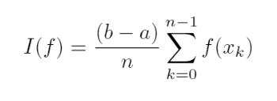
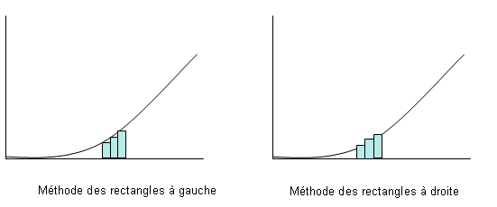
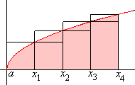
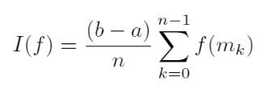
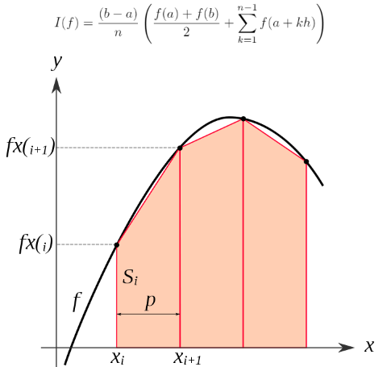
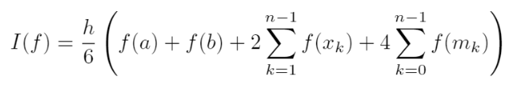

# Projet_Analyse_Numérique
Visual Studio Code , Python

## Sommaire: 
1. [Introduction](#Introduction)
2. [Méthodes d’intégration numérique](#Méthodes)
3. [Interpolation polynomiale](#Interpolation)
4. [Conclusion](#Conclusion)

## Introduction:

## Méthodes d’intégration numérique:

#### But 
 
Le but de ce chapitre est d’aborder le calcul général de l’intégrale d’une fonction f(x) sur un domaine fini délimité par des bornes finies a et b ( les cas des bornes infinies n’est donc pas couvert ).

#### Motivations
 
Dans certains cas très limités, une telle intégrale peut être calculée analytiquement (à la main). Cependant, ce n’est que très rarement possible, et le plus souvent un des cas suivants se présente :

– Le calcul analytique est long, compliqué et rébarbatif

– Le résultat de l’intégrale est une fonction compliquée qui fait appel à d’autres fonctions elles-même longues à évaluer

– Cette intégrale n’a pas d’expression analytique (par exemple la fonction erreur : Er)
Dans tous ces cas, on préfèrera calculer numériquement la valeur de l’intégrale I.
 
 #### Principe
 
 L’idée principale est de trouver des méthodes qui permettent de calculer rapidement une valeur approchée I de l’intégrale à calculer.
 
 #### Performances
 
 La performance d’une méthode se juge en comparant:
 
• la précision du résultat : Celle-ci se caractérise en estimant l’erreur entre l’approximation et la valeur réelle de l’intégrale : E = I-I

La valeur de l’erreur ne peut pas être calculée exactement puisqu’en général, on ne connaît pas l’intégrale I que l’on cherche à calculer. Cependant, une majoration peut souvent être estimée en étudiant le développement en série de Taylor de la fonction f(x).

• La rapidité d’exécution nécessaire pour atteindre ce résultat. De manière générale, toutes les méthodes
peuvent atteindre de très grandes précisions. Cependant, le temps de calcul augmente avec la précision. Ce temps n’augmente pas de la même manière pour toutes les méthodes si bien que certaines s’avèrent plus efficaces que d’autres. En particulier, le temps de calcul des méthodes de quadrature est proportionnel au nombre de points où la fonction f(x) est évaluée.
 
#### Méthode du rectangle
La méthode des rectangles est une méthode algorithmique permettant d’encadrer l’aire d’un domaine sous une courbe représentative de fonction et sur un intervalle donné.

Intuitivement, plus le nombre de rectangles grandit, plus les sommes des aires des rectangles vont se rapprocher vers l’intégrale de la fonction sur le même intervalle.

#### Méthode du point milieu
En analyse numérique, la méthode du point médian est une méthode permettant de réaliser le calcul numérique d'une intégrale.

Le principe est d'approcher l'intégrale de la fonction f par l'aire d'un rectangle de base le segment [a,b] et de hauteur f(a+b/2).

 
#### Méthode du trapèze
La méthode des trapèzes est une méthode pour le calcul numérique d'une intégrale I s'appuyant sur l'interpolation linéaire par intervalles.

Pour obtenir de meilleurs résultats, on découpe l'intervalle [a , b] en n intervalles plus petits et on applique la méthode sur chacun d'entre eux. Bien entendu, il suffit d'une seule évaluation de la fonction à chaque nœud :

 
 #### Méthode de Simpson 
La méthode de Simpson est une technique de calcul numérique d'une intégrale.

Un polynôme étant une fonction très facile à intégrer, on approche l'intégrale de la fonction f sur l'intervalle [a, b], par l'intégrale de P sur ce même intervalle. On a ainsi, la simple formule : 

 
 
## Interpolation polynomiale:
#### Interpolation de Lagrange

#### Phénomène de Runge
  
## Conclusion

